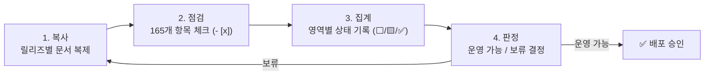
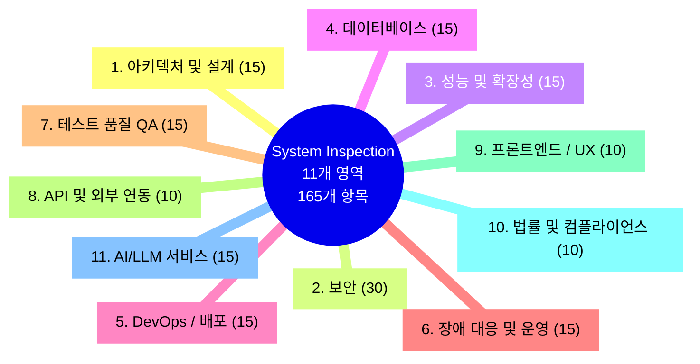
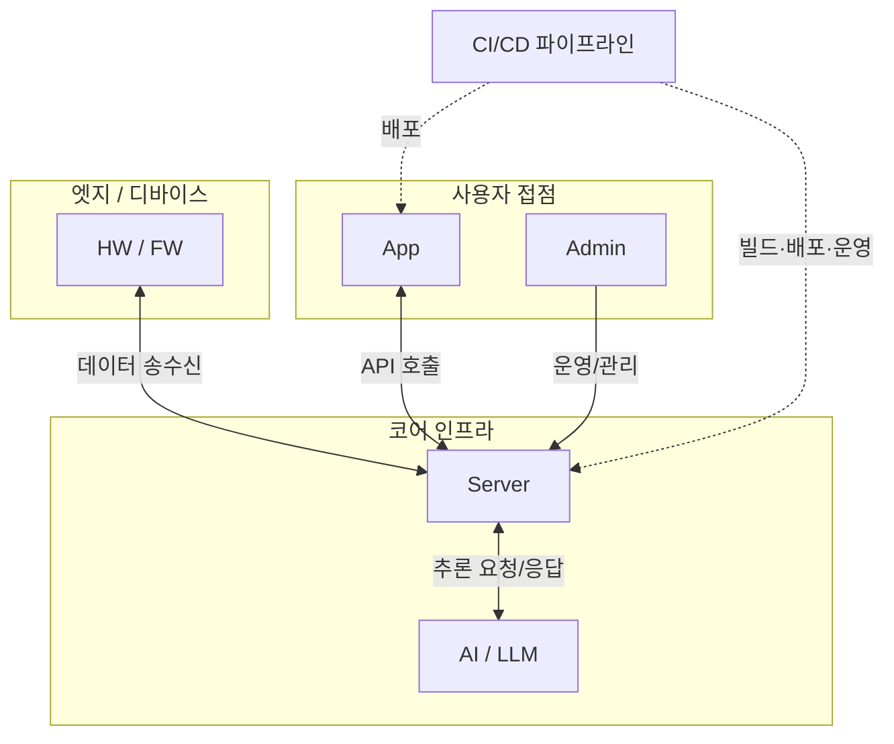

# System Inspection Checklist · 배포 전 자가 점검 표준

> **배포 버튼을 누르기 전에, 이 시스템이 정말 운영 가능한가?** 를 스스로에게 묻는 문서입니다.
> 운영 안정성 · 보안 · 확장성 · 품질을 **11개 영역 · 165개 항목**으로 나눠 빠짐없이 점검하고,
> 마지막에 **‘운영 가능 / 보류’를 명확히 판단**하는 자가 점검 프레임워크입니다.

`11개 영역` · `165개 점검 항목` · `HW · Server · AI · App · Admin · CI/CD`

---

## ⚡ 3줄 요약

> 1. **무엇** — 배포 전에 시스템의 운영 안정성·보안·확장성·품질을 **11개 영역 · 165개 항목**으로 빠짐없이 점검하는 자가 점검 체크리스트입니다.
> 2. **어떻게** — 릴리즈마다 이 문서를 **복사 → 점검(`- [x]`) → 집계(결과 표) → 판정(운영 가능/보류)** 의 4단계로 채웁니다.
> 3. **결과** — 마지막 [📊 점검 결과](#-점검-결과)·[📝 최종 의견](#-최종-의견) 표에서 **‘배포해도 되는가’를 근거와 함께 명확히 판단**합니다.

---

## 이 문서를 왜 쓰는가

- 🧭 **빠뜨림 방지.** — “돌아가니까 배포”가 아니라, 보안·장애·확장성까지 **표준 목록으로** 확인한다.
- 🗣️ **합의의 언어.** — 점검 결과 표로 **‘무엇이 위험하고, 배포해도 되는가’** 를 근거와 함께 공유한다.
- ♻️ **재사용.** — 릴리즈마다 이 문서를 복사해 채워, 팀·프로젝트가 달라도 **같은 기준**으로 판단한다.

## 🚀 사용법 (4단계)

1. **복사** — 릴리즈/시스템별로 이 문서를 복제한다.
2. **점검** — 각 항목의 `- [ ]` 를 확인하며 `- [x]` 로 체크한다. (해당 없으면 `N/A` 표기)
3. **집계** — 하단 [📊 점검 결과](#-점검-결과) 표에 영역별 상태(⬜/🟨/✅)와 비고를 기록한다.
4. **판정** — [📝 최종 의견](#-최종-의견)에 위험·조치를 정리하고 **운영 가능 여부 / 배포 승인 여부**를 명시한다.

---

## 🗺️ 점검 영역 한눈에 보기

11개 점검 영역과 각 항목 수를 하나의 지도로 표현했습니다.

---

## 🔍 검토 범위 관계도

이 체크리스트가 다루는 시스템 구성요소(HW / Server / AI / App / Admin / CI/CD)의 관계입니다.

---

## 📖 목차

| # | 영역 | 항목 수 | # | 영역 | 항목 수 |
|---|---|---|---|---|---|
| 1 | [아키텍처 및 설계](#1-아키텍처-및-설계-검증) | 15 | 7 | [테스트 품질(QA)](#7-테스트-품질qa) | 15 |
| 2 | [보안(Security)](#2-보안security) | 30 | 8 | [API 및 외부 연동](#8-api-및-외부-연동) | 10 |
| 3 | [성능 및 확장성](#3-성능-및-확장성) | 15 | 9 | [프론트엔드 / UX](#9-프론트엔드--ux) | 10 |
| 4 | [데이터베이스(DB)](#4-데이터베이스db) | 15 | 10 | [법률 및 컴플라이언스](#10-법률-및-컴플라이언스) | 10 |
| 5 | [DevOps / 배포](#5-devops--배포) | 15 | 11 | [AI/LLM 서비스](#11-aillm-서비스-추가-점검) | 15 |
| 6 | [장애 대응 및 운영](#6-장애-대응-및-운영) | 15 | | **합계** | **165** |

> 💡 각 영역의 세부 체크 항목은 아래 **▶ 토글**을 펼쳐서 확인·체크하세요.

---

# 📌 검토 범위

- HW / FW
- Server
- AI
- App
- Admin
- CI/CD

---

# 1. 아키텍처 및 설계 검증

<b>▶ 1. 아키텍처 및 설계 검증 (15개 항목)</b>

## 1.1 시스템 구조
- [ ] 모듈 분리 적절성
- [ ] 의존성 최소화
- [ ] 확장 가능한 구조인지
- [ ] 단일 장애점(SPOF) 존재 여부
- [ ] MSA/모놀리식 구조 적합성

## 1.2 코드 품질
- [ ] 코드 컨벤션 통일
- [ ] 중복 코드 제거
- [ ] 함수/클래스 책임 분리
- [ ] 하드코딩 제거
- [ ] 기술 부채 목록화

## 1.3 설계 문서화
- [ ] 시스템 아키텍처 문서
- [ ] API 명세서
- [ ] ERD/DB 설계서
- [ ] 시퀀스 다이어그램
- [ ] 배포 구조도

---

# 2. 보안(Security)

<b>▶ 2. 보안(Security) (30개 항목)</b>

## 2.1 인증/인가
- [ ] JWT 만료 처리
- [ ] 세션 탈취 방어
- [ ] RBAC 권한 분리
- [ ] 관리자 권한 제한
- [ ] MFA 적용 여부

## 2.2 입력값 검증
- [ ] SQL Injection 방지
- [ ] XSS 방지
- [ ] CSRF 방지
- [ ] Path Traversal 방지
- [ ] 파일 업로드 검증

## 2.3 비밀정보 관리
- [ ] .env Git 제외
- [ ] API Key 암호화
- [ ] Secret Manager 사용
- [ ] DB 계정 최소 권한
- [ ] 키 Rotation 정책

## 2.4 네트워크 보안
- [ ] HTTPS 강제
- [ ] TLS 버전 점검
- [ ] CORS 정책 확인
- [ ] Rate Limit 적용
- [ ] 방화벽 정책 검토

## 2.5 서버 보안
- [ ] 불필요 포트 차단
- [ ] root 실행 금지
- [ ] SSH 접근 제한
- [ ] 패키지 최신화
- [ ] 보안 패치 적용

## 2.6 감사 및 추적
- [ ] 접근 로그 저장
- [ ] 관리자 액션 로깅
- [ ] 이상행위 탐지
- [ ] Audit Trail 구축
- [ ] 로그 위변조 방지

---

# 3. 성능 및 확장성

<b>▶ 3. 성능 및 확장성 (15개 항목)</b>

## 3.1 성능 테스트
- [ ] 부하 테스트
- [ ] 스트레스 테스트
- [ ] Spike 테스트
- [ ] 장시간 안정성 테스트
- [ ] TPS 측정

## 3.2 응답속도
- [ ] API 응답시간 측정
- [ ] DB Query 최적화
- [ ] N+1 문제 제거
- [ ] 캐시 전략 적용
- [ ] CDN 적용 여부

## 3.3 확장성
- [ ] 수평 확장 가능 여부
- [ ] Auto Scaling 지원
- [ ] Stateless 구조 여부
- [ ] Queue 기반 처리
- [ ] 비동기 처리 적용

---

# 4. 데이터베이스(DB)

<b>▶ 4. 데이터베이스(DB) (15개 항목)</b>

## 4.1 스키마 관리
- [ ] Migration 체계화
- [ ] Index 최적화
- [ ] FK 제약조건 확인
- [ ] 데이터 타입 적절성
- [ ] Nullable 정책 검토

## 4.2 데이터 안정성
- [ ] Backup 정책
- [ ] Restore 테스트
- [ ] Replication 구성
- [ ] 장애복구 절차
- [ ] 데이터 무결성 검증

## 4.3 운영 데이터 관리
- [ ] 로그 테이블 정리 정책
- [ ] 보관 기간 정책
- [ ] 개인정보 마스킹
- [ ] 삭제 정책(GDPR 등)
- [ ] 아카이빙 전략

---

# 5. DevOps / 배포

<b>▶ 5. DevOps / 배포 (15개 항목)</b>

## 5.1 CI/CD
- [ ] 자동 빌드
- [ ] 자동 테스트
- [ ] 자동 배포
- [ ] Rollback 지원
- [ ] Blue/Green 또는 Canary 배포

## 5.2 환경 분리
- [ ] Dev/Staging/Prod 분리
- [ ] 환경변수 분리
- [ ] 테스트 DB 분리
- [ ] IAM 권한 분리
- [ ] 설정 파일 분리

## 5.3 컨테이너/K8S
- [ ] Docker 최적화
- [ ] 이미지 경량화
- [ ] Health Check 설정
- [ ] Resource Limit 설정
- [ ] Secret Mount 관리

---

# 6. 장애 대응 및 운영

<b>▶ 6. 장애 대응 및 운영 (15개 항목)</b>

## 6.1 모니터링
- [ ] CPU/RAM 모니터링
- [ ] API 응답 모니터링
- [ ] DB 상태 모니터링
- [ ] Error Tracking
- [ ] 실시간 알림

## 6.2 로그 관리
- [ ] 중앙 로그 수집
- [ ] 로그 레벨 관리
- [ ] 에러 로그 분류
- [ ] Trace ID 관리
- [ ] 개인정보 로그 제외

## 6.3 장애 대응
- [ ] Runbook 작성
- [ ] 장애 대응 프로세스
- [ ] 비상 연락 체계
- [ ] MTTR 목표 설정
- [ ] 장애 재현 환경 구축

---

# 7. 테스트 품질(QA)

<b>▶ 7. 테스트 품질(QA) (15개 항목)</b>

## 7.1 테스트 종류
- [ ] Unit Test
- [ ] Integration Test
- [ ] E2E Test
- [ ] Regression Test
- [ ] Smoke Test

## 7.2 테스트 커버리지
- [ ] 핵심 로직 커버리지
- [ ] 실패 시나리오 테스트
- [ ] 경계값 테스트
- [ ] 동시성 테스트
- [ ] 예외 처리 테스트

## 7.3 QA 프로세스
- [ ] 테스트 케이스 문서화
- [ ] 버그 추적 시스템
- [ ] QA 승인 프로세스
- [ ] 릴리즈 체크리스트
- [ ] 사용자 Acceptance Test

---

# 8. API 및 외부 연동

<b>▶ 8. API 및 외부 연동 (10개 항목)</b>

## 8.1 API 안정성
- [ ] Timeout 처리
- [ ] Retry 정책
- [ ] Circuit Breaker
- [ ] Idempotency 보장
- [ ] 버전 관리(v1/v2)

## 8.2 외부 서비스 장애 대응
- [ ] Fallback 처리
- [ ] 장애 전파 방지
- [ ] 캐시 응답 전략
- [ ] Queue Buffer 처리
- [ ] Third-party SLA 확인

---

# 9. 프론트엔드 / UX

<b>▶ 9. 프론트엔드 / UX (10개 항목)</b>

## 9.1 UI 안정성
- [ ] 반응형 지원
- [ ] 브라우저 호환성
- [ ] 모바일 대응
- [ ] 접근성(Accessibility)
- [ ] 다국어 처리

## 9.2 사용자 경험
- [ ] 로딩 처리
- [ ] 에러 메시지 친절성
- [ ] 재시도 UX
- [ ] Offline 대응
- [ ] UX Flow 검증

---

# 10. 법률 및 컴플라이언스

<b>▶ 10. 법률 및 컴플라이언스 (10개 항목)</b>

## 10.1 개인정보
- [ ] 개인정보 수집 동의
- [ ] 개인정보 암호화
- [ ] 개인정보 삭제 기능
- [ ] 로그 개인정보 제거
- [ ] 국내/해외 규정 준수

## 10.2 라이선스
- [ ] 오픈소스 라이선스 검토
- [ ] 상업적 사용 가능 여부
- [ ] GPL 오염 여부
- [ ] 서드파티 계약 확인
- [ ] 저작권 표시

---

# 11. AI/LLM 서비스 추가 점검

<b>▶ 11. AI/LLM 서비스 추가 점검 (15개 항목)</b>

## 11.1 모델 안정성
- [ ] Hallucination 대응
- [ ] Prompt Injection 방어
- [ ] Toxic Output 필터링
- [ ] 모델 버전 관리
- [ ] 비용 폭주 방지

## 11.2 AI 운영
- [ ] Token Usage 제한
- [ ] Rate Limit
- [ ] 모델 Failover
- [ ] 캐시 전략
- [ ] 사용자 Abuse 방지

## 11.3 AI 품질
- [ ] 응답 정확도 평가
- [ ] Prompt 테스트셋
- [ ] 벤치마크 측정
- [ ] 모델 Drift 감지
- [ ] Human Feedback 루프

---

# 📊 점검 결과

> 각 영역 점검 후 상태를 기록합니다. **⬜ 미점검 · 🟨 조건부 · ✅ 통과**

| 구분 | 상태 | 비고 |
|---|---|---|
| Architecture | ⬜ | |
| Security | ⬜ | |
| Performance | ⬜ | |
| Database | ⬜ | |
| DevOps | ⬜ | |
| Monitoring | ⬜ | |
| QA | ⬜ | |
| API | ⬜ | |
| Frontend | ⬜ | |
| Compliance | ⬜ | |
| AI | ⬜ | |

---

# 📝 최종 의견

- 주요 위험 요소:
- 개선 필요 사항:
- 우선 조치 항목:
- 운영 가능 여부:
- 배포 승인 여부:

---

# 📅 점검 정보

| 항목 | 내용 |
|---|---|
| 점검 일자 | 2026-05-14 |
| 점검자 | LEE SEUNG JU |
| 대상 시스템 | ICONIA 전체 개발 내역 |
| 버전 | MVP 1.0.0 |
| 환경 | Dev |
